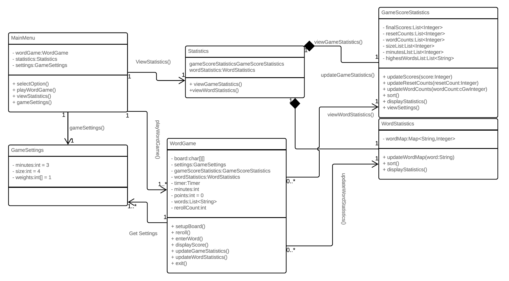

# Design Discussion

## Design 1 

## Design 2 

Roger:
    Pros: Well structured, listed both UI and the classes
    Cons: No global access to each game's score/settings etc.

## Design 3
 

Roger:
    Pros: The classes contained all necessary fields/methods.
    Cons: The classes are interconnected so the structure is not as clear.

## Design 4 
 

Roger:
    Pros: The design is simple, easy to read.
    Cons: The arrows are a little bit confusing. For example, which line does "minus 5 points" belong to?

## Team Design

## Summary
