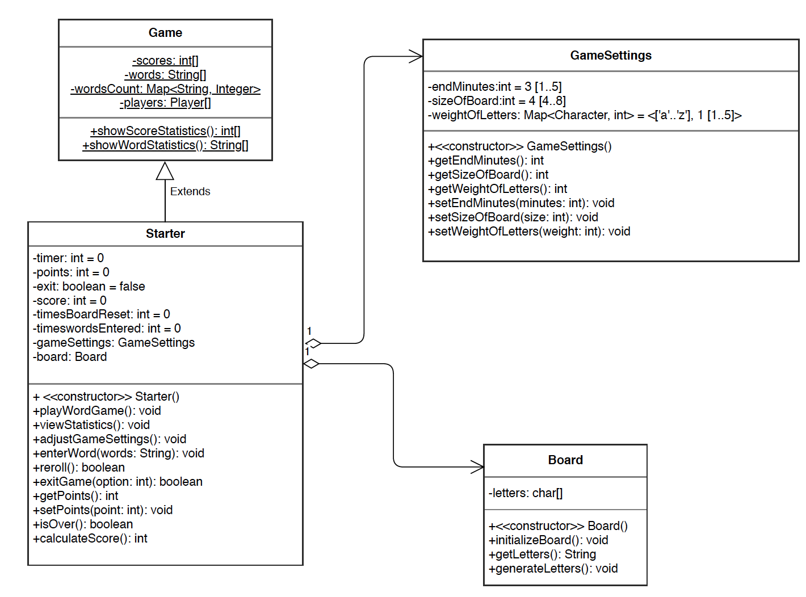
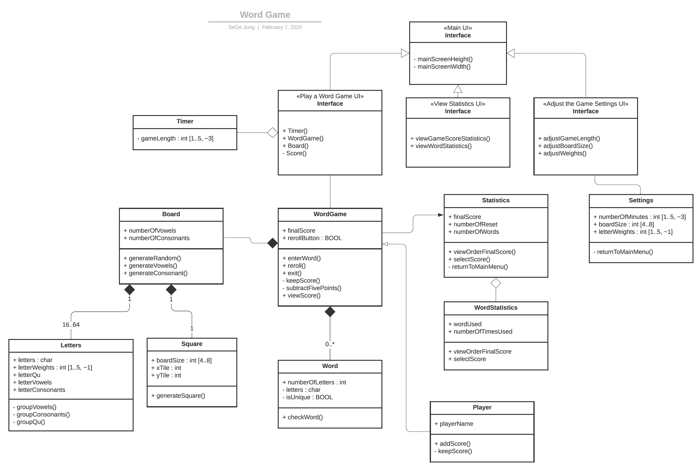

# Design Discussion

## Design 1 [Roger Kiew]

### Pros
SJ: The cleanest looking UML from our team. It has a global variable that scores and settings are accessed from. All the int variables have default and ranges.
### Cons
SJ: The class diagram is broad and does not address a lot of the requirement details. The diagram could help with more detail on enterWord(), statistics, and initializeBoard. 

## Design 2 [SeGe Jung]

### Pros
RK: Well structured, listed both UI and the classes
### Cons
SJ: UI could be consolidated into one Main UI. 

RK: No global access to each game's score/settings etc.
## Design 3 [Brian Hoang]
 
### Pros
SJ: Concise and structured view of the classes. Address all of the functions of the wordgame application.

RK: The classes contained all necessary fields/methods.
  
### Cons
SJ: It would be worth articulating the enterWord() method as it is listed as one of the requirements. What constitutes a word? There is no information on what the board will consist of. Vowels, weights, letter ‘Qu’, or the size. Would like to see some more classes articulating this work. Aggregation of board can be classes letters and word.

RK: The classes are interconnected so the structure is not as clear.
## Design 4 [Mo Yang]
 
### Pros
SJ: Good broad overview of the application 
### Cons
SJ: Lacks to show all of the requirements. Also the relationships between classes lack sophistication. All the arrows suggest same relationship between all classes whereas there might be association or aggregation relationships. 
Would be upgraded with more details. For example, for the timer, you can write timer: int: 0..4. 
The requirements of player entering words that are more than two letters are not reflected in the class diagram. 
There are two statistics: one is word and one is score. This is not reflected in the diagram.

## Team Design

## Summary
SJ: All the team members had solid structure in their UML class diagrams. The level of detailed differed, however, by group effort, we maximized our pros and minimized our cons. 
This process was done through weekly meetings and threads in Microsoft Teams. 
