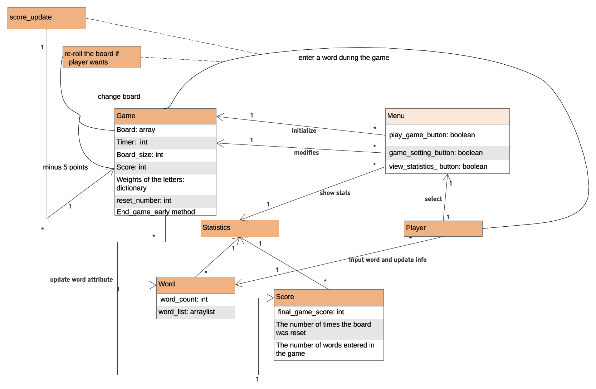

# Design Discussion

## Design 1 [Roger Kiew]

### Pros
SJ: The cleanest looking UML from our team. It has a global variable that scores and settings are accessed from. All the int variables have default and ranges.

BH: Not overly complex and is easy to understand.

MY: Roger's Design has less UML classes as he consolidated a lot of attributes and features. In this way, he made the UML much clean for other people to understand the structure.

### Cons
SJ: The class diagram is broad and does not address a lot of the requirement details. The diagram could help with more detail on enterWord(), statistics, and initializeBoard. 

BH: Consider using lists instead of arrays so that items can be dynamically added to the list of scores and words instead of arrays which have a fixed length. 

MY: The game statistics can be made a separate class as it has more features and more ways that a player can interact with the game. In the current design, it was a little bit too simple because stats were only addressed through showScoreStatistics() and showWordStatistics() under Game.

## Design 2 [SeGe Jung]

### Pros
RK: Well structured, listed both UI and the classes

BH: Most detailed and did a good job of meeting the requirements. 

MY: Compared to RK's design, SJ's design has a better overall structure. More classes were considered to show the relationship and interacction.

### Cons
SJ: UI could be consolidated into one Main UI. 

RK: No global access to each game's score/settings etc.

BH: Could remove simple methods such as subtractFivePoints and simply subtract five points from the score during a reroll. 

MY: under UI section, there were four classes. Three sub classes can all be included under the main UI so that the overall class structure is clearer and less confusing.

## Design 3 [Brian Hoang]
 
### Pros
SJ: Concise and structured view of the classes. Address all of the functions of the wordgame application.

RK: The classes contained all necessary fields/methods.

MY: Brian's design has clear structure while maintaing good amount of details. The method explanation near each relationship clearly states how different classes interact with each other.
  
### Cons
SJ: It would be worth articulating the enterWord() method as it is listed as one of the requirements. What constitutes a word? There is no information on what the board will consist of. Vowels, weights, letter ‘Qu’, or the size. Would like to see some more classes articulating this work. Aggregation of board can be classes letters and word.

RK: The classes are interconnected so the structure is not as clear.

MY: the right hand side of the design has similar unclear relationship/interaction among Statistics, GameScoreStatistics, and WordStatistics.

## Design 4 [Mo Yang]
 
### Pros
SJ: Good broad overview of the application 

RK: The design is simple, easy to read.

BH:The text between classes help demonstrate their relationship and the flow of the design.

### Cons
SJ: All the arrows suggest same relationship between all classes whereas there might be association or aggregation relationships. 
The requirements of player entering words that are more than two letters are not reflected in the class diagram. 
There are two statistics: one is word and one is score. This is not reflected in the diagram.

RK: The arrows are a little bit confusing. For example, which line does "minus 5 points" belong to?

BH:A separate class for game settings may be ideal. More details on the methods of classes would help display how the design fulfills the requirements. 

## Team Design

## Summary
SJ: All the team members had solid structure in their UML class diagrams. The level of detailed differed, however, by group effort, we maximized our pros and minimized our cons. 
This process was done through weekly meetings and threads in Microsoft Teams. 

BH: We discussed our designs over a screen-share on Microsoft Teams and it was great to hear feedback from outside perspectives with constructive criticism. All the class diagrams had a good basis for their overall design and we were able to come to an agreement on the final design with little to no trouble. 

MY: It was great to share each team member's thoughts on our last assigment and review all four designs together. We really learned a lot by examining each design's pros and cons. Then we summarized all the things into our final design, which shows a clear structure of classes while maintaing a good amount of details to indicate the relationship of how the game works.

RK: All of our designs looked good at first but when we compared them to each other's design, there were some rooms for improvements. I am glad that we got a chance to see how other people will approach the requirements and we all learned from each other.
