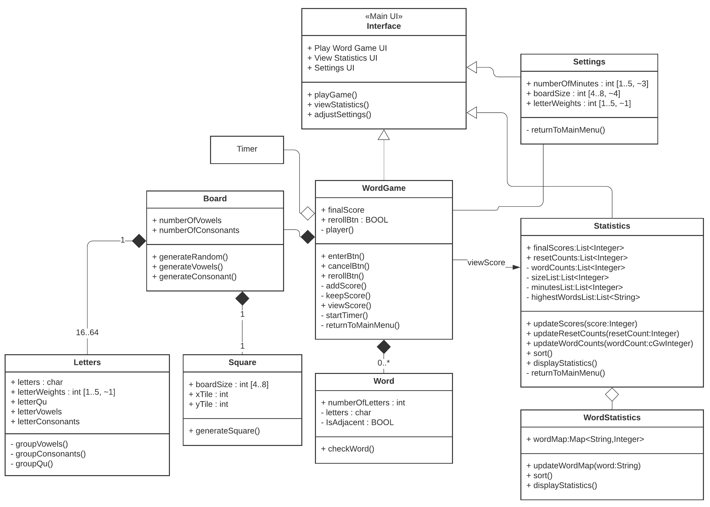

# Design Document

**Author**: Team112

## 1 Design Considerations

*The subsections below describe the issues that need to be addressed or resolved prior to or while completing the design, as well as issues that may influence the design process.*

Most of the software requirements have been discussed and clarified with the use case model. 

### 1.1 Assumptions

The assumption is that the game software will be a standalone architecture that does not need to be tied into other architectures such as widgets, settings, and phone notification. Also, the game application will be for one user with a single device. It does not have multiplayer capability. 
Another assumption of the requirement is that no sound or haptic feedback is necessary for the game application.

### 1.2 Constraints

A constraint is that the phone orientation has to be in portrait mode. All the interfaces are locked in this orientation. The intent is so that the game can be played one handed operation. 
Another constraint is that the phone size has to be smaller than 6 inches diagnolly. 

### 1.3 System Environment

The hardware has to be a smartphone device that has a screen 6 inches or less. The hardware must have a keyboard so that the user may enter words. 
The software has operating Android KitKat or above. Anything older than this operating version will not be compatible.

### 1.4 Extensibility
New capabilities and features can be added to the architecture without major modifications. The main architecture is set and new features will be adding new classes. 

### 1.5 Modularity
The software allows for testing in isolation before integrating to the entire system.

### 1.6 Performance
The software does not take too much memory when operating. It provides smooth experience. 

### 1.7 Usability
The software is usable for the users. The user interface is intuitive, simple, and avoid extraneous information. 

## 2 Architectural Design

*The architecture provides the high-level design view of a system and provides a basis for more detailed design work. These subsections describe the top-level components of the system you are building and their relationships.*

### 2.1 Component Diagram

*This section should provide and describe a diagram that shows the various components and how they are connected. This diagram shows the logical/functional components of the system, where each component represents a cluster of related functionality. In the case of simple systems, where there is a single component, this diagram may be unnecessary; in these cases, simply state so and concisely state why.*

### 2.2 Deployment Diagram

*This section should describe how the different components will be deployed on actual hardware devices. Similar to the previous subsection, this diagram may be unnecessary for simple systems; in these cases, simply state so and concisely state why.*

## 3 Low-Level Design

*Describe the low-level design for each of the system components identified in the previous section. For each component, you should provide details in the following UML diagrams to show its internal structure.*

### 3.1 Class Diagram

 

## 4 User Interface Design

 

The graphic user interface has four main interfaces- Main UI, Settings UI, Play UI, and Statistics UI. 

### 4.1 Main UI
Main UI is the front page of the application. This interface is what the users will view as soon as they open the game. The main UI has three buttons. It has play the game, statistics, and settings. Also on the button, there is a help button that has a tutorial text. All interfaces except the Main UI has a back button to allow users to return to main menu. 

### 4.2 Settings UI
Settings UI allows the user adjust various settings of the games. The game minutes allow the users to select the length of the game ranging from 0 to 5 minutes. Default is 3 minutes. 
Board size is adjusting the board size from 4 to 8. Default is 4. 
Weight of letters allows users to assign weights to each letters. Weights range from 1 to 5. 

### 4.3 Play Game UI
Play game UI is where the users can play the word game. A board size is shown and the letters are randomly generated. The point counter is on the very top of the screen. Down below, there is a timer. There is a reroll button that regenerates the board and takes off 5 points. The keyboard is automatically open and users may begin to type in words. Once they press enter, the application will recognize as an entry. 

### 4.4 Statistics UI
Statistics UI has game score statistics and word statistics. Both statistics are populated in one screen. By the game number, there is a clickable button that users can click to view settings. Users can also sort columns. 

