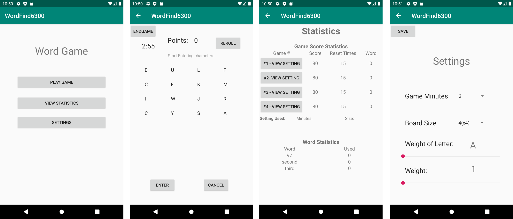

# USER MANUAL

**Topics:**

* [Overview](#overview)
* [Play Game](#play-game)
    + [Board](#board)
    + [Scoring](#scoring)
* [Game Settings](#game-settings)
    + [Weight](#weight)
    + [Game Length](#game-length)
    + [Board Size](#board-size)
* [Game Statistics](#game-statistics)
    + [Word Statistics](#word-statistics)
    + [Game Statistics](#game-statistics)

## Overview
The WordGame application is a game that users can enter words using letters from a randomized board and keep score. 
See below for four interfaces. Main UI, Play Game UI, Settings UI, and Statistics UI.
 
 
## Play Game
### Board
The WordGame application is a game that users can enter words using letters from a randomized board and score. 

### Scoring
Each valid word that is entered by the user will count as one point. A valid word has to include two letters that are horizontally, vertically, or diagnolly adjacent. Word can only include letters and no strings. User may wish to reroll the board at a cost of 5 points. 

## Game Settings
### Weight
Weight is a value ranging from 1 to 5 that is assigned to each letters. The weight determined the probability of the letter being generated on the board. 

### Game Length
Game length the game length is from 3 minutes to 5 minutes. 

### Board Size
The board size can be from 4x4 to 8x8.

## Game Statistics
### Word Statistics
Word statistics shows a list of words that the player entered and the number of times entered.

### Game Statistics
Game statistics displays tables of points, number of times reroll, and game numbers. 
Each game number has a link so that users can view game settings. 

